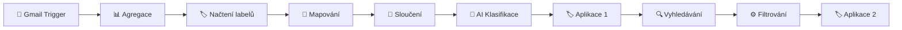

# Gmail Trigger V6 - AI Email Classification Workflow

> 🤖 Automatická klasifikace Gmail emailů pomocí umělé inteligence

## 📝 Popis

Tento n8n workflow automaticky analyzuje příchozí Gmail emaily a klasifikuje je do 8 kategorií pomocí Mistral AI modelu. Každý email je označen příslušným labelem pro lepší organizaci vaší pošty.

## 🎯 Funkce

- ⚡ **Automatické spouštění** každou minutu
- 🧠 **AI klasifikace** pomocí Mistral AI modelu
- 🏷️ **8 kategorií** pro třídění emailů
- 📧 **Zpracování souvisejících emailů** od stejného odesílatele  
- 💬 **Podrobné komentáře** k jednotlivým nodům
- 📊 **Vizuální přehled** workflow

## 📋 Kategorie klasifikace

1. **To respond** - Emaily vyžadující osobní odpověď
2. **FYI** - Upozornění a žádosti o akci
3. **Comment** - Žádosti o feedback nebo názor
4. **Notification** - Automatické notifikace a updates
5. **Meeting update** - Kalendářní události a schůzky
6. **Awaiting reply** - Čeká na vaši odpověď
7. **Actioned** - Potvrzení vašich akcí
8. **Marketing** - Propagační obsah a newslettery

## 🔧 Požadavky

### n8n Setup
- n8n instance s LangChain nody
- Gmail OAuth2 credentials
- OpenRouter API klíč

### Gmail Labels
Vytvořte si následující labely v Gmailu:
- `To respond`
- `FYI` 
- `Comment`
- `Notification`
- `Meeting update`
- `Awaiting reply`
- `Actioned`
- `Marketing`

## 🚀 Instalace

1. **Stáhněte workflow**: `Gmail_Trigger_V6_Commented.json`
2. **Importujte** do n8n (Settings → Import from file)
3. **Nakonfigurujte credentials**:
   - Gmail OAuth2 účet
   - OpenRouter API klíč
4. **Ověřte connections** mezi nody
5. **Aktivujte workflow**

## 🔄 Jak workflow funguje

### Detailní tok:

1. **Trigger** - Sleduje nové emaily každou minutu
2. **Agregace** - Shromažďuje email data
3. **Labels** - Načte dostupné Gmail labely
4. **Mapování** - Vytvoří slovníky pro práci s labely
5. **Sloučení** - Kombinuje data pro AI
6. **AI Klasifikace** - Mistral model analyzuje email
7. **První aplikace** - Přiřadí klasifikační label
8. **Vyhledávání** - Najde související emaily
9. **Filtrování** - Zpracuje labely souvisejících emailů
10. **Finální aplikace** - Aplikuje všechny relevantní labely

## 🎨 Vizuální komentáře

Workflow obsahuje **14 sticky notes** s podrobnými komentáři:

- 📧 **Gmail Trigger** - Vysvětluje funkci triggeru
- 📊 **Agregace** - Popisuje shromažďování dat  
- 🏷️ **Gmail Labely** - Načítání labelů z API
- 🔄 **Mapování 1 & 2** - Vytváření slovníků
- 🔗 **Sloučení** - Kombinování datových proudů
- 🤖 **AI Model** - Popis Mistral modelu
- 🧠 **AI Klasifikace** - Logika třídění
- 🏷️ **Aplikace 1 & 2** - Přiřazování labelů
- 🔍 **Vyhledávání** - Hledání souvisejících emailů
- ⚙️ **Filtrování** - Zpracování labelů
- 📋 **Přehled** - Celkový workflow diagram

## ⚙️ Konfigurace

### AI Model
- **Provider**: OpenRouter
- **Model**: `mistralai/mistral-small-3.2-24b-instruct:free`
- **Prompt**: Předkonfigurovaný pro email klasifikaci

### Gmail Settings
- **Polling**: Každou minutu
- **Filtry**: Všechny nové emaily
- **Operace**: Přidávání labelů

### Výkon
- **Timeout**: 3600 sekund
- **Timezone**: UTC
- **Execution**: Ukládání všech logů

## 🔍 Troubleshooting

### Časté problémy:

**Gmail credentials**
- Ověřte OAuth2 autorizaci
- Zkontrolujte Google API scope

**OpenRouter API**
- Ověřte API klíč
- Zkontrolujte kredit na účtu

**Labely**
- Ujistěte se, že existují požadované labely
- Zkontrolujte názvy labelů (case-sensitive)

**Výkon**
- Workflow může být pomalejší při velkém množství emailů
- Zvažte úpravu polling intervalu

## 📊 Statistiky

- **Nody**: 13 funkčních + 14 komentářů
- **Velikost souboru**: ~21 kB
- **Průměrná doba běhu**: 10-30 sekund
- **Podporované formáty**: Plain text, HTML emails

## 🤝 Přispívání

Tento workflow je open source. Můžete:
- Reportovat bugs
- Navrhovat vylepšení
- Přispívat kódem
- Sdílet vlastní varianty

## 📄 Licence

Tento projekt je licencován pod GPL-3.0 licencí.

## 👨‍💻 Autor

**Petr Prenghy**
- GitHub: [@pprenghy](https://github.com/pprenghy)
- Email: pprenghy@gmail.com

---

💡 **Tip**: Pro lepší výsledky klasifikace můžete upravit AI prompt podle svých specifických potřeb v nodu "Classify Email with AI".
